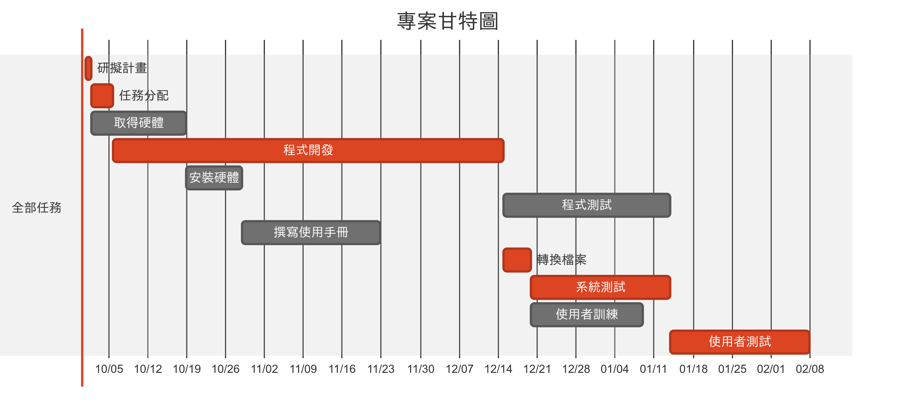
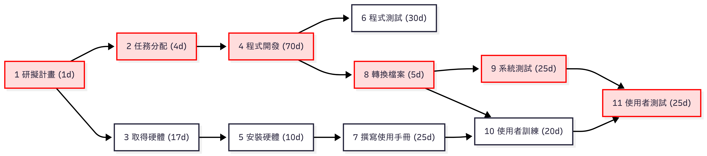

# 系統開發專案 — 工作分解、甘特圖與 PERT/CPM

## 1. 工作分解結構清單（WBS）

| 任務 | 說明         | 需時(天) | 前置任務   |
|------|------------|---------|------------|
| 1    | 研擬計畫     | 1       |            |
| 2    | 任務分配     | 4       | 1          |
| 3    | 取得硬體     | 17      | 1          |
| 4    | 程式開發     | 70      | 2          |
| 5    | 安裝硬體     | 10      | 3          |
| 6    | 程式測試     | 30      | 4          |
| 7    | 撰寫使用手冊 | 25      | 5          |
| 8    | 轉換檔案     | 5       | 4          |
| 9    | 系統測試     | 25      | 8          |
| 10   | 使用者訓練   | 20      | 7, 8       |
| 11   | 使用者測試   | 25      | 9, 10      |

---

## 2. 甘特圖（Gantt）

---

## 3. PERT/CPM 流程圖

